# DC PluginX

**Local Atlassian Marketplace Knowledge Base for Atlassian Data Center Plugins**

DC PluginX is a complete, production-ready system for synchronizing, storing, and managing Atlassian Data Center plugins from the Atlassian Marketplace. It provides full metadata ingestion, version history storage, local JAR storage, and a web UI for browsing and downloading plugins.

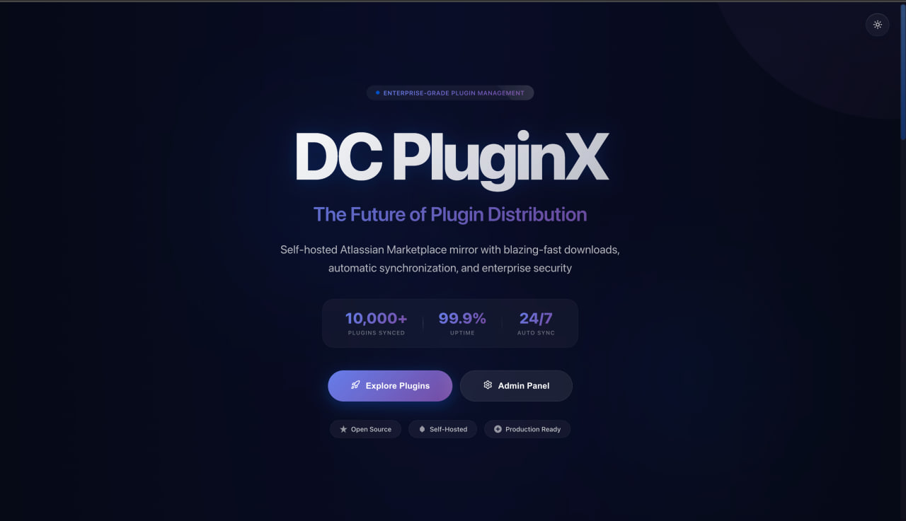

## Features

- **Complete Metadata Ingestion**: Fetches all Atlassian Data Center plugins from Atlassian Marketplace
- **Version History**: Parses and stores complete version history including release notes
- **Local JAR Storage**: Downloads and stores plugin JAR files locally
- **Resumable Sync**: All sync operations are resumable and fault-tolerant
- **Web UI**: Browse plugins, view versions, and download JARs
- **Admin Dashboard**: Monitor and control sync operations in real-time
- **Jira Version Filtering**: Filter plugins by Jira version compatibility (8-11)
- **Rate Limit Protection**: Built-in rate limiting and retry logic
- **Production Ready**: Fully containerized with Docker Compose

## Technology Stack

### Backend
- Node.js + TypeScript
- Express.js
- PostgreSQL
- Prisma ORM
- Axios for HTTP requests
- Cheerio for HTML parsing

### Frontend
- React 18 + TypeScript
- Vite
- React Router
- Axios

### Infrastructure
- Docker + Docker Compose
- PostgreSQL 15
- Nginx

## Quick Start

### Prerequisites

- Docker and Docker Compose installed
- At least 10GB of free disk space
- Stable internet connection

### Installation

1. **Clone the repository** (or navigate to the project directory):

```bash
cd dc-pluginx
```

2. **Start the application**:

```bash
docker-compose up -d
```

This will:
- Start PostgreSQL database
- Build and start the backend API
- Build and start the frontend
- Run database migrations
- Create necessary storage directories

3. **Access the application**:

- **Frontend**: http://localhost:3000
- **Backend API**: http://localhost:3001
- **Health Check**: http://localhost:3001/health

### First-Time Setup

1. Open the Admin UI: http://localhost:3000/admin

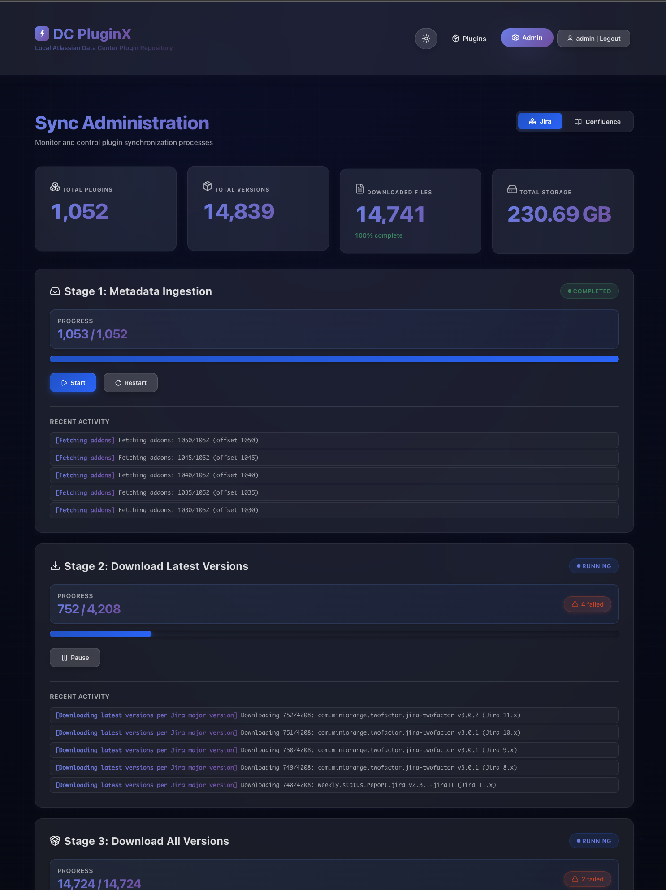

2. Run the sync stages in order:

   **Stage 1: Metadata Ingestion**
   - Click "Start" to begin fetching plugin metadata
   - This will fetch ~6000+ plugins from the Marketplace
   - Duration: 2-4 hours (depending on rate limits)
   - Can be paused and resumed at any time

   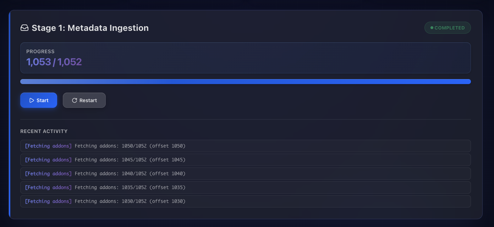

   **Stage 2: Download Latest Versions**
   - Downloads the latest compatible version of each plugin
   - Duration: 4-8 hours
   - Resumable

   

   **Stage 3: Download All Versions**
   - Downloads all available versions
   - Duration: 24-48 hours
   - Resumable
   - Optional: Only run if you need all historical versions

   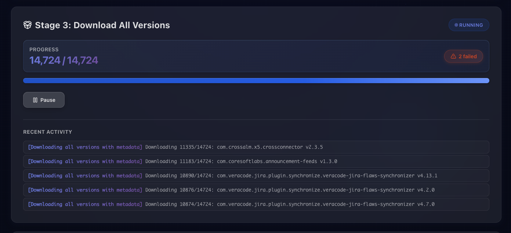

3. Monitor sync progress with detailed statistics and logs:

   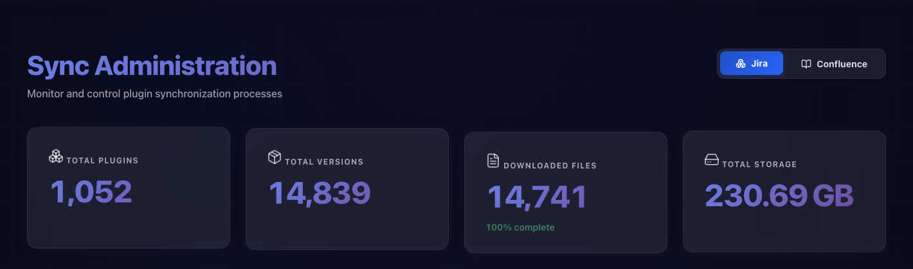
   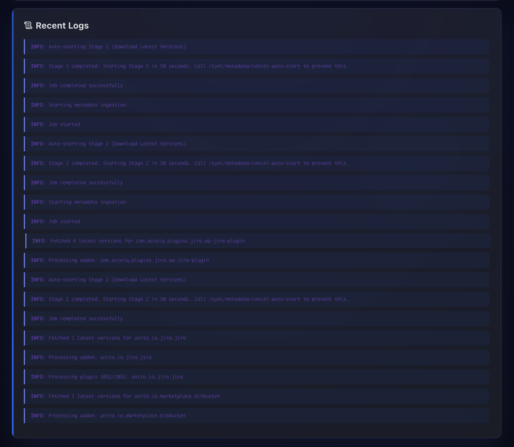

## Development Mode

### Prerequisites

- Node.js 18+
- PostgreSQL 15
- npm or yarn

### Setup

1. **Install dependencies**:

```bash
npm install
```

2. **Set up environment variables**:

```bash
cp .env.example .env
```

Edit `.env` with your local database credentials.

3. **Start PostgreSQL**:

```bash
docker-compose up -d postgres
```

4. **Run migrations**:

```bash
cd backend
npx prisma migrate dev
```

5. **Start backend**:

```bash
npm run dev:backend
```

6. **Start frontend** (in another terminal):

```bash
npm run dev:frontend
```

7. **Access the application**:
   - Frontend: http://localhost:3000
   - Backend: http://localhost:3001

## Project Structure

```
dc-pluginx/
├── backend/
│   ├── src/
│   │   ├── api/              # REST API routes
│   │   ├── config/           # Configuration
│   │   ├── jobs/             # Sync job implementations
│   │   ├── lib/              # Shared libraries
│   │   ├── services/         # Core services
│   │   ├── types/            # TypeScript types
│   │   ├── utils/            # Utilities
│   │   └── index.ts          # Main entry point
│   ├── prisma/
│   │   └── schema.prisma     # Database schema
│   ├── Dockerfile
│   ├── package.json
│   └── tsconfig.json
├── frontend/
│   ├── src/
│   │   ├── api/              # API client
│   │   ├── pages/            # React pages
│   │   ├── styles/           # CSS styles
│   │   ├── types/            # TypeScript types
│   │   ├── App.tsx           # Main app component
│   │   └── main.tsx          # Entry point
│   ├── Dockerfile
│   ├── nginx.conf
│   ├── package.json
│   ├── tsconfig.json
│   └── vite.config.ts
├── docker-compose.yml
├── .env.example
├── package.json
└── README.md
```

## API Documentation

### Sync Endpoints

#### Get Sync Status
```
GET /api/sync/status
```

Returns the current status of all sync jobs.

#### Stage 1: Metadata Ingestion
```
POST /api/sync/metadata/start
POST /api/sync/metadata/pause
POST /api/sync/metadata/resume
```

#### Stage 2: Download Latest Versions
```
POST /api/sync/download-latest/start
POST /api/sync/download-latest/pause
POST /api/sync/download-latest/resume
```

#### Stage 3: Download All Versions
```
POST /api/sync/download-all/start
POST /api/sync/download-all/pause
POST /api/sync/download-all/resume
```

### Plugin Endpoints

#### List Plugins
```
GET /api/plugins?search=<query>&jiraVersion=<version>&page=<page>&limit=<limit>
```

Parameters:
- `search` (optional): Search by name, addon key, or vendor
- `jiraVersion` (optional): Filter by Jira version compatibility (8-11)
- `page` (optional): Page number (default: 1)
- `limit` (optional): Items per page (default: 20)

**UI Example:**

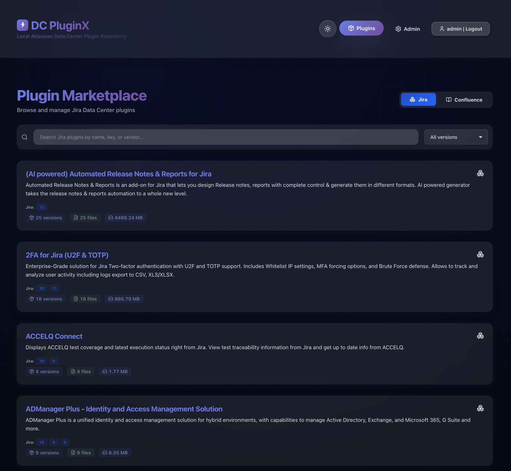

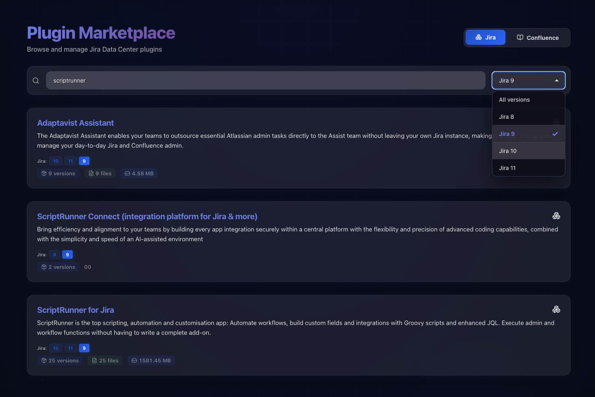

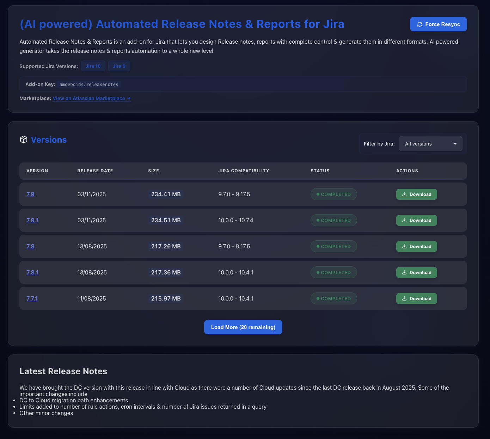

#### Get Plugin Details
```
GET /api/plugins/:addonKey
```

**UI Example:**

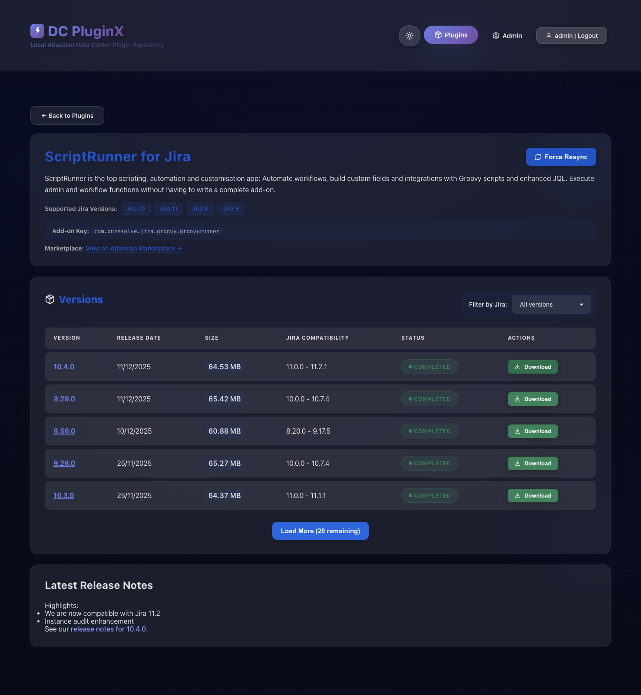

#### Get Plugin Versions
```
GET /api/plugins/:addonKey/versions?jiraVersion=<version>
```

**UI Example:**

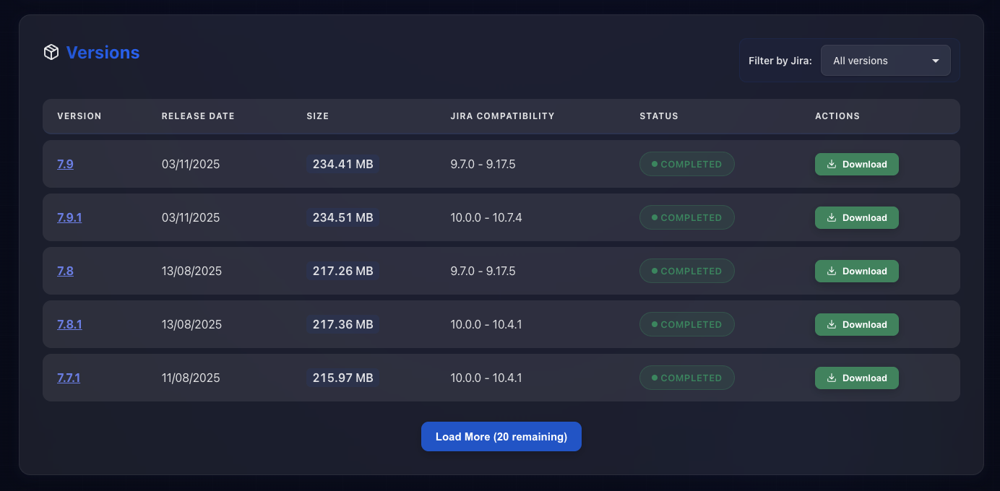

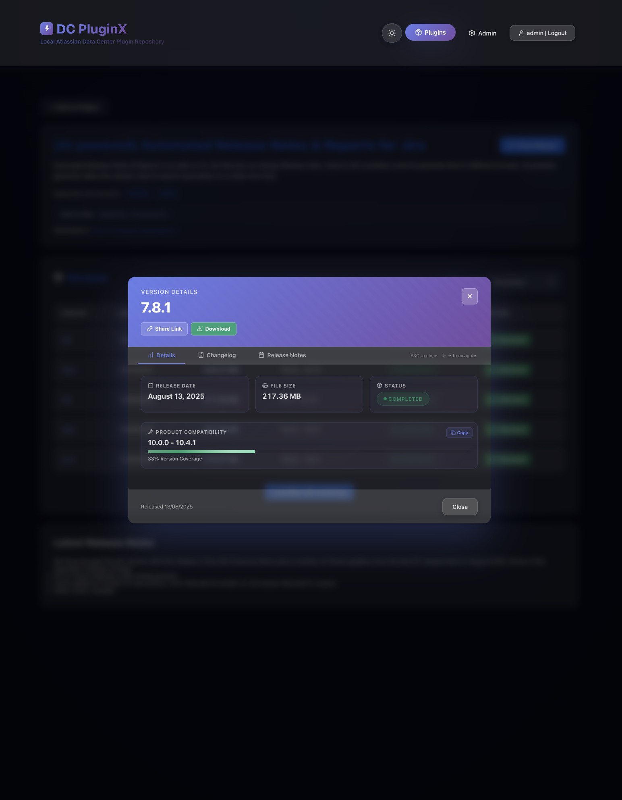

#### Download Plugin
```
GET /api/plugins/:addonKey/download/:version
```

#### Get Statistics
```
GET /api/plugins/stats/summary
```

## Configuration

### Environment Variables

#### Backend

| Variable | Default | Description |
|----------|---------|-------------|
| `DATABASE_URL` | - | PostgreSQL connection string |
| `BACKEND_PORT` | `3001` | Backend server port |
| `NODE_ENV` | `development` | Environment mode |
| `JAR_STORAGE_PATH` | `/data/jars` | Path for JAR file storage |
| `MARKETPLACE_BASE_URL` | `https://marketplace.atlassian.com` | Marketplace API URL |
| `MARKETPLACE_RATE_LIMIT_DELAY` | `1000` | Delay between API calls (ms) |
| `MARKETPLACE_MAX_RETRIES` | `5` | Maximum retry attempts |
| `MARKETPLACE_RETRY_DELAY` | `5000` | Delay between retries (ms) |
| `JOB_CHUNK_SIZE` | `100` | Items per batch |
| `JOB_CONCURRENT_DOWNLOADS` | `5` | Concurrent downloads |

#### Frontend

| Variable | Default | Description |
|----------|---------|-------------|
| `VITE_API_URL` | `http://localhost:3001` | Backend API URL |

## Database Schema

The system uses PostgreSQL with the following main tables:

- **Plugin**: Plugin metadata (addon key, name, vendor, etc.)
- **PluginVersion**: Version information (version, release date, Jira compatibility, release notes)
- **PluginFile**: Downloaded JAR files (path, checksum, download status)
- **SyncJob**: Sync job state (status, progress, errors)
- **SyncJobProgress**: Detailed progress tracking
- **SyncJobLog**: Job execution logs

## Sync Engine Architecture

### Fault Tolerance

- **Persistent State**: All progress stored in database
- **Chunked Processing**: Processes data in configurable batches
- **Automatic Retry**: Failed operations retry with exponential backoff
- **Rate Limiting**: Respects Marketplace API rate limits
- **Graceful Shutdown**: Pauses safely without data loss

### Job States

- `IDLE`: Job not started
- `RUNNING`: Job in progress
- `PAUSED`: Job paused by user
- `FAILED`: Job encountered fatal error
- `COMPLETED`: Job finished successfully

### Stage Details

#### Stage 1: Metadata Ingestion
1. Fetches plugin list from Marketplace API (paginated)
2. For each plugin:
   - Fetches versions from REST API
   - Parses version history from HTML
   - Stores metadata in database
3. Tracks offset for resumability

#### Stage 2: Download Latest Versions
1. Queries all plugins from database
2. Determines latest compatible version (Jira 8-11)
3. Downloads JAR files concurrently (configurable concurrency)
4. Calculates SHA-256 checksums
5. Updates download status

#### Stage 3: Download All Versions
1. Queries all versions from database
2. Downloads each version (skips existing)
3. Handles failed downloads gracefully
4. Fully resumable

## Troubleshooting

### Sync is slow
- Adjust `MARKETPLACE_RATE_LIMIT_DELAY` (increase = slower but safer)
- Increase `JOB_CONCURRENT_DOWNLOADS` for Stage 2/3
- Check internet connection speed

### Database connection errors
- Ensure PostgreSQL container is running: `docker-compose ps`
- Check database credentials in `.env`
- View logs: `docker-compose logs postgres`

### Out of disk space
- Plugins require ~50-100GB for all versions
- Stage 2 (latest only) requires ~10-20GB
- Monitor with: `docker system df`

### Backend won't start
- Check logs: `docker-compose logs backend`
- Ensure migrations ran: `docker-compose exec backend npx prisma migrate deploy`
- Verify environment variables

### Frontend shows connection errors
- Verify backend is running: `curl http://localhost:3001/health`
- Check CORS settings
- Verify `VITE_API_URL` in frontend build

## Performance Tuning

### Rate Limiting
```env
MARKETPLACE_RATE_LIMIT_DELAY=500  # Faster (may hit rate limits)
MARKETPLACE_RATE_LIMIT_DELAY=2000 # Slower (safer)
```

### Concurrent Downloads
```env
JOB_CONCURRENT_DOWNLOADS=10  # Faster (more bandwidth)
JOB_CONCURRENT_DOWNLOADS=3   # Slower (less bandwidth)
```

### Batch Size
```env
JOB_CHUNK_SIZE=50   # Smaller batches (more commits)
JOB_CHUNK_SIZE=200  # Larger batches (fewer commits)
```

## Maintenance

### View Logs
```bash
docker-compose logs -f backend
docker-compose logs -f frontend
docker-compose logs -f postgres
```

### Restart Services
```bash
docker-compose restart backend
docker-compose restart frontend
```

### Backup Database
```bash
docker-compose exec postgres pg_dump -U pluginx pluginx > backup.sql
```

### Restore Database
```bash
cat backup.sql | docker-compose exec -T postgres psql -U pluginx pluginx
```

### Clean Up
```bash
# Stop all services
docker-compose down

# Remove all data (including database and JAR files)
docker-compose down -v

# Remove Docker images
docker-compose down --rmi all
```

## Security Considerations

- No authentication required (designed for local/trusted networks)
- CORS enabled for all origins in development
- No rate limiting on API endpoints
- Marketplace credentials not required (public API)

## License

This project is for educational and personal use.

## Support

For issues and questions:
- Check logs first: `docker-compose logs`
- Review this README
- Check database state: `docker-compose exec postgres psql -U pluginx pluginx`

## Acknowledgments

- Built for synchronizing Atlassian Marketplace data
- Uses public Atlassian Marketplace APIs
- Designed for Atlassian Data Center plugin management
